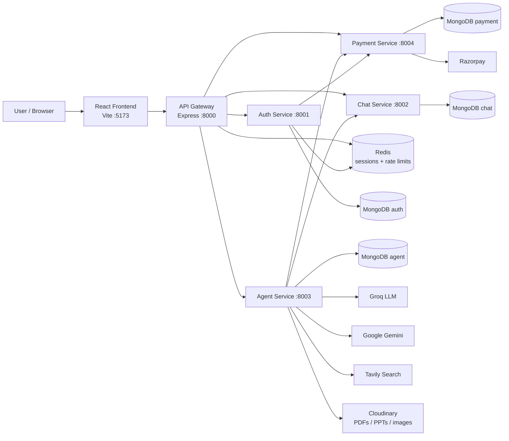

# Architecture

This page explains how the entire CortexAI system fits together.

## Architecture Diagram



## Components

### Frontend

- A React single-page app served by Vite on **port 5173**.
- Talks **only** to the API Gateway (`http://localhost:8000`).
- Handles Google sign-in, chat UI, message rendering (markdown + code), and the PDF/PPT/Image/code viewer panels.

### API Gateway

- Runs on **port 8000** and is the single entry point for the frontend.
- Its `protect` middleware reads the `session` cookie and looks it up in **Redis**. Without a valid session it rejects the request.
- Forwards requests to the correct service based on the URL prefix:
  - `/api/auth/*` → Auth Service
  - `/api/chat/*` → Chat Service
  - `/api/agent/*` → Agent Service (also rate-limited)
  - `/api/payment/*` → Payment Service
  - `/api/me` → handled by the gateway itself (current user + credits)
- Adds an `x-user-id` header when forwarding so downstream services know who the user is.

### Auth Service

- Runs on **port 8001**.
- Verifies Google ID tokens with **Firebase Admin**.
- Creates/loads the user in its own MongoDB database.
- Creates a session in **Redis** and sets the `session` cookie (7 days).
- Calls the **Payment Service** to create the user's credit account on first login.

### Chat Service

- Runs on **port 8002**.
- Owns conversations and messages (MongoDB).
- Reads the user ID from the `x-user-id` header (added by the gateway).

### Agent Service

- Runs on **port 8003**.
- The core AI engine. Receives `{ prompt, conversationId, agent }`.
- Routes the prompt to the right agent (Auto/Chat/Coding/Search/PDF/PPT/Vision) using a **LangGraph** state machine.
- Uses external AI services: **Groq** (default LLM), **Google Gemini** (image generation), **Together AI** (defined but not the default).
- Uses **Tavily** for web search results.
- Generates PDFs (PDFKit) and PPTs (PptxGenJS) and uploads them to **Cloudinary**.
- Deducts credits by calling the **Payment Service**.
- Saves messages and updates conversation titles by calling the **Chat Service** directly.

### Payment Service

- Runs on **port 8004**.
- Manages user credits, subscription plans (Free / Pro / Business), Razorpay orders, and transaction history (MongoDB).
- Receives the **Razorpay webhook** to confirm captured payments.

## Databases

Each service uses its **own MongoDB database** (MongoDB Atlas in development):

| Service | Database | Main data |
| ------- | -------- | --------- |
| Auth | `...mongodb.net/auth` | Users |
| Chat | `...mongodb.net/chat` | Conversations, Messages |
| Agent | `...mongodb.net/agent` | (connected, no models defined) |
| Payment | `...mongodb.net/payment` | UserCredits, Transactions, Orders |

**Redis** is shared: it stores sessions and rate-limit counters.

## Message Brokers / Events

There is **no message broker** (no Kafka, no RabbitMQ, no pub/sub). All communication is synchronous HTTP.

## External Services

| Service | Used by | Purpose |
| ------- | ------- | ------- |
| Firebase | Frontend + Auth | Google sign-in (web SDK + Admin SDK) |
| Groq | Agent | Default LLM (llama-3.3-70b-versatile) |
| Google Gemini | Agent | Image generation |
| Together AI | Agent | Secondary LLM (defined, not default) |
| Tavily | Agent | Web search results |
| Cloudinary | Agent | Storing generated PDFs, PPTs, images |
| Razorpay | Payment | Order creation and payment capture |

## Service-to-Service Communication

- **Gateway → Redis**: checks sessions, rate limiting.
- **Auth → Redis**: writes/removes sessions.
- **Auth → Payment**: `POST /api/payment/credits/init` on first login.
- **Gateway → Payment**: `GET /api/payment/credits` to build the `/api/me` response.
- **Agent → Payment**: `POST /api/payment/credits/deduct` per AI request.
- **Agent → Chat**: saves messages (`/save-message`), reads/updates conversation titles.

See [service-communication.md](./service-communication.md) for details.

## Request Flow Example (a chat message)

```text
User sends "Write a calculator app" (Auto agent)
   ↓
Frontend POST /api/agent/chat
   ↓
API Gateway: protect middleware → session found in Redis
   ↓
Gateway forwards to Agent Service with x-user-id header
   ↓
Agent Service deducts 1 credit from Payment Service
   ↓
Agent Service saves user message in Chat Service
   ↓
LangGraph routes prompt → Coding Agent → Groq LLM
   ↓
Agent Service saves assistant message in Chat Service
   ↓
Response (aiResponse + files) returned → Gateway → Frontend
```

## Why This Architecture?

- Each concern is **isolated** in its own service: auth, chat history, AI, payments. A change in one does not require restarting the others.
- The **API Gateway** gives the frontend a single URL, centralizes authentication, and hides the internal services.
- **Redis** sessions let the gateway validate every request without touching the database.
- The AI logic is **modular**: adding a new agent is just a new node in the LangGraph + a file in `agents/`.