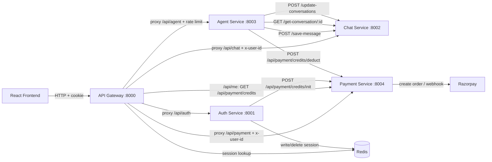

# Service Communication

The backend is a microservices architecture, so services need to talk to each other. This page explains exactly how, based on the actual code.

## Communication Methods Used

| Method | Where | Used for |
| ------ | ----- | -------- |
| **HTTP (REST)** | Gateway → services (proxy), services → services (axios) | All inter-service calls |
| **HTTP headers** | `x-user-id` | Passing the authenticated user's ID |
| **Redis** | Shared cache | Sessions + rate limiting |
| **SSE (Server-Sent Events)** | Agent Service → frontend (through gateway) | Streaming AI tokens |

**No message broker** (no Kafka/RabbitMQ), **no gRPC**, **no WebSockets**, and **no event bus** are used. Every service-to-service call is a synchronous HTTP request.

## The Two Communication Layers

### 1. Frontend → Gateway → Service

The frontend only talks to the gateway. The gateway proxies requests to services:

```text
Frontend
   ↓  HTTP + session cookie
API Gateway (checks session in Redis, adds x-user-id)
   ↓
Correct microservice (auth / chat / agent / payment)
```

### 2. Service → Service (direct HTTP)

Services call each other directly with `axios`:

```text
Auth Service ──POST /api/payment/credits/init──► Payment Service
Agent Service ──POST /api/payment/credits/deduct─► Payment Service
Gateway ──────GET /api/payment/credits─────────► Payment Service
Agent Service ──POST /save-message──────────────► Chat Service
Agent Service ──GET /get-conversation/:id───────► Chat Service
Agent Service ──POST /update-conversations──────► Chat Service
```

## Diagram of All Calls



## Each Call Explained

### Gateway → Redis (session check)

- `gateway/middleware/auth.middleware.js` reads the `session` cookie and calls `redis.get("session-<uuid>")`. Used on every protected route.

### Auth Service → Redis (session write/delete)

- On login: `redis.set("session-<uuid>", userJson, "EX", 7 days)`.
- On logout: `redis.del("session-<uuid>")`.

### Auth Service → Payment Service (credit init)

- On **first login**, `auth.controller.js` calls:

```js
POST {PAYMENT_SERVICE_URL}/api/payment/credits/init
body: { userId, email, name }
```

- Purpose: create the user's credit account and grant the free-plan bonus.
- Failure is logged and **does not break login** (timeout 5000 ms).

### Gateway → Payment Service (credits for /api/me)

- `gateway/controller/user.controller.js` calls:

```js
GET {PAYMENT_SERVICE_URL}/api/payment/credits
header: x-user-id: <userId>
```

- Purpose: show the user's plan and credit balance in the sidebar.
- Failure is logged; `credits` is returned as `null` (the user data still comes back).

### Agent Service → Payment Service (credit deduction)

- For every AI request, `agent.controller.js` calls:

```js
POST {PAYMENT_SERVICE_URL}/api/payment/credits/deduct
body: { userId, agent: "coding" }
```

- The cost depends on the agent (message 1, image 3, pdf 5, ppt 5).
- If the response says `canProceed: false`, the request is rejected with `403 insufficient credits`.
- If the Payment Service is down, the deduction is **skipped** (logged) so chat still works.

### Agent Service → Chat Service (save messages + titles)

- After receiving/sending the user message, `agent.controller.js` saves both messages:

```js
POST {CHAT_SERVICE_URL}/save-message
body: { conversationId, role: "user"|"assistant", content, agent?, pdfUrl?, pptUrl?, imageUrl? }
```

- It also checks the conversation title and, if still "New Chat", generates one and updates it:

```js
GET  {CHAT_SERVICE_URL}/get-conversation/:id
POST {CHAT_SERVICE_URL}/update-conversations   body: { id, title }
```

- These calls use `process.env.CHAT_SERVICE_URL` directly (no `/api` prefix, straight to port 8002).

## Why These Methods?

- **HTTP/REST** is used because each service is a simple Express server and the calls are request/response by nature (check session, deduct credit, save message). It keeps infrastructure minimal — no broker to install or configure.
- **Redis** is used for sessions and rate limiting because it is fast and shared between gateway and auth, with built-in TTL for expiry.
- **`x-user-id` header** lets the gateway authenticate once and pass identity down without each service re-verifying the cookie.
- **SSE** is used for streaming because it is a simple one-way text protocol over plain HTTP — the frontend reads `data:` lines with the native `fetch` API.

## Timeouts and Failure Behavior

| Call | Timeout | On failure |
| ---- | ------- | ---------- |
| Auth → Payment (init) | 5000 ms | Logged; login continues |
| Gateway → Payment (credits) | 5000 ms | Logged; credits = null |
| Agent → Payment (deduct) | 5000 ms | Logged; request continues (free-ish fallback) |
| Agent → Chat (save/title) | none | Logged; response still returned |

The pattern is: **cross-service failures degrade gracefully instead of failing the whole request.**